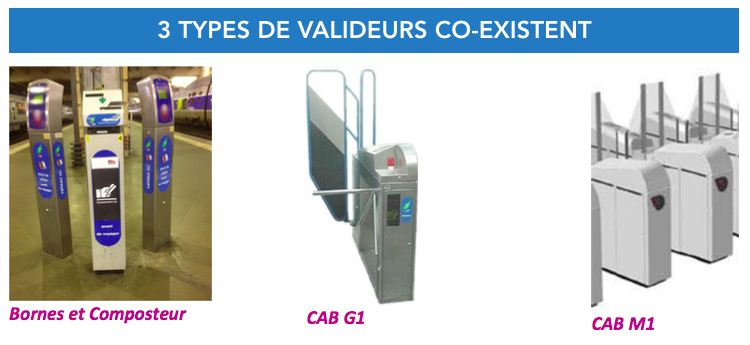

# COMPRENDRE NOS DONNÉES 

## MESURER LA MOBILITÉ EN ILE-DE-FRANCE : UN ENJEU DE TAILLE

**Comment évaluer les flux des voyageurs en Île-de-France ? Et surtout, pourquoi faire ? L’enjeu est essentiel pour une gestion optimale des transports en commun de la région, et pour le devenir du territoire dans son ensemble. SNCF Transilien en prend la pleine mesure en initiant une réflexion au long cours sur les outils et procédés de mesure des flux.**

SNCF Transilien dispose d’une multitude d’outils pour estimer les flux le plus précisément possible, déployés sur l’ensemble des gares du territoire : enquêtes de terrain, traces GSM, comptages automatiques ou manuels, mais aussi capteurs “innovants” tels que les caméras thermiques ou tapis de comptage, etc. Chacun de ces outil présente leurs avantages et inconvénients, souvent liés à des coûts non négligeables de mise en place. La seule méthode qui permette aujourd’hui de remonter des données de mobilité quotidiennement, sur l’ensemble des réseaux et grâce à du matériel existant repose sur les données dites de « validation », correspondant aux informations recueillies lorsqu’un voyageur valide son titre de transport. Malheureusement, celles-ci se révèlent encore imparfaites car souvent incomplètes... plaidant en faveur d’autres systèmes de remontée des données. Nous vous proposons ici focus sur ces précieuses ressources de la compréhension du territoire, et sur les procédures actuellement à l’étude pour mieux les mettre en valeur.

## QU’EST-CE QU’UNE DONNÉE DE VALIDATION ?

Lorsqu’un usager utilise un moyen de transport collectif, il achète un titre qu’il doit valider avant ou pendant sa montée en bus/métro/RER/train. Cet acte de validation renseigne sur le titre possédé et l’horaire de validation. Ainsi, au-delà de la fonction première de contrôle du billet, il s’agit bien là d’une donnée récoltée qui permet de donner des informations sur le taux de fréquentation d’une gare.

Des informations complémentaires sont également collectées :

**La technologie de validation**, à savoir si le titre de transport est « magnétique » (un ticket cartonné) ou « télébilletique » (qu’il suffit de « bipper », comme les pass Navigo, les ImagineR...).

**Le tarif du titre validé** : cet indicateur nous permet de savoir s’il s’agit d’un abonnement spécifique, d’un ticket + ou d’un billet Origine-Destination. S’il est issu ou non d’un carnet, tarif réduit ou plein ainsi que sa période et sa zone de validité. 

**L’identifiant de la borne de validation** : ceci nous renseigne notamment sur l’emplacement exact du valideur dans la gare. 

-------------------------------------------------------------------------------------------------------------------------------

**ENCART INFORMATIF** 

CONTRAIREMENT À L’IDÉE QUE L’ON S’EN FAIT SOUVENT, IL EST À CE JOUR IMPOSSIBLE DE COLLECTER DES INFORMATIONS “PERSONNELLES” CONCERNANT LES VOYAGEURS EN RÈGLE. LES NUMÉROS DE CARTES SONT ANONYMISÉS ET L’IDENTIFIANT ASSOCIÉ EST MODIFIÉ TOUS LES SIX MOIS.

-------------------------------------------------------------------------------------------------------------------------------

## DU BON USAGE DES VALIDATIONS

Que faire de toutes ces données de validation ? Au-delà de l’obtention des flux « bruts », l’enjeu est de traiter la masse de ces données pour comprendre les logiques de mobilités qui se tissent au sein du territoire. Une meilleure exploitation des données de validation permettrait, par exemple, de modéliser les déplacements observés sur le réseau de manière plus réaliste, et par conséquent :

- D’anticiper les problèmes de saturation ayant lieu en gare (aux valideurs, guichets/automates de paiement, et sur les quais).  

-  De prévenir certains comportements frauduleux, grâce à la mise en lumière des horaires et des lieux les plus concernés.

- et surtout de mesurer l’impact des différents projets pouvant animer le réseau de manière temporaire ou plus durable, allant des opérations réalisées en gare (contrôle, mise en place de valideurs supplémentaires etc.) jusqu’aux changements de tarif (dézonage, compléments de parcours, mise en place du Tarif Toutes Zones), en passant par les créations à venir de nouvelles gares (Créteil Pompadour, Grand Paris...).

## DES DONNÉES SOUVENT LACUNAIRES

Tout la difficulté du sujet vient de l’incomplétude intrinsèque des données de validation dont dispose SNCF Transilien, notamment celles issues des gares dites “ouvertes”. Sur les 380 gares d’Ile-de-France, environ 200 d’entre-elles, qui capitalisent 20% du trafic, ne disposent pas de CAB bloquant l’accès aux quais (cf. encadré ci-contre). Les usagers ne sachant pas qu’il est tout aussi obligatoire de valider son titre sur les composteurs et bornes ou ne jugeant pas nécessaire de le faire, le taux de validation dans les gares dites « ouvertes » reste très faible.

D’autre part, les travaux de rénovation régulièrement menés sur le réseau et les phénomènes de saturation peuvent aussi altérer la remontée de données. Il n’est pas rare qu’en circonstances exceptionnelles (pic de trafic, travaux de maintenance, pannes momentanées, journées gratuité-transport, etc.) les CAB d’une gare entière soient désactivés, ce qui engendrent une forte perte de données.

Enfin, les comportements des usagers peuvent aussi jouer sur la précision des données collectées. Par exemple, si une voyageur valide avant que la personne précédente n’ait franchi le portique, cela peut engendrer des désynchronisations de passage. Si deux personnes passent ensemble, collées l’une contre l’autre, le système risque de n’en compter qu’une. Une personne de moins de 90 cm ne sera pas comptabilisé et, à l’inverse, certaines poussettes ou bagages volumineux peuvent être détectés. 

## COMMENT AMÉLIORER LA COLLECTE DES DONNÉES ?

A priori, l’une des solutions les plus évidentes serait d’équiper l’ensemble des gares du réseau de CAB, qui permettent un comptage automatique du nombre de passages… malheureusement, le temps et le coût rendent une telle opération difficilement réalisable. Pour y pallier, mais gagner malgré tout en qualité d’information, une réponse plus astucieuse invite à se tourner vers des techniques statistiques permettant de « corriger » les données manquantes : soit à partir des données existantes (grâce à leur modélisation), ou bien à partir de capteurs complémentaires testés ici et là en gare. Par exemple, certains portillons innovants sont installés petit à petit en gare, agrémentés de systèmes de détection d’ouverture ou de comptage pour compléter les données de validation. 

L’enjeu est effectivement de taille, on l’aura compris au fil de ce récit : il en va de la compréhension du territoire francilien et de la cohérence de l’offre de transport avec les besoins des voyageurs.